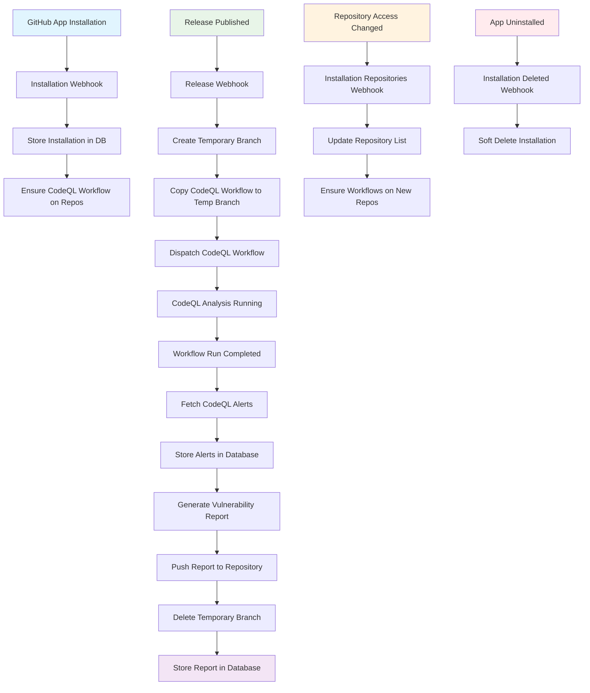
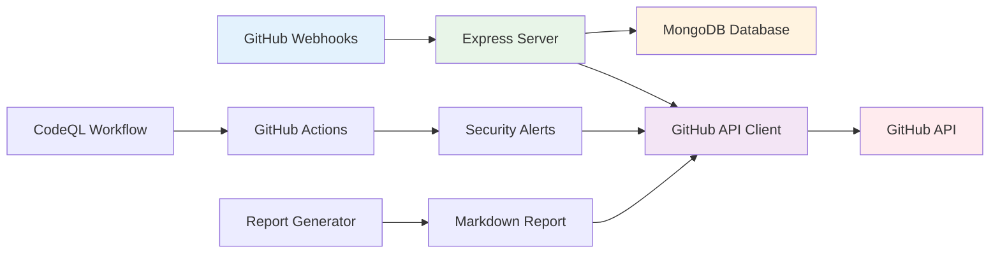
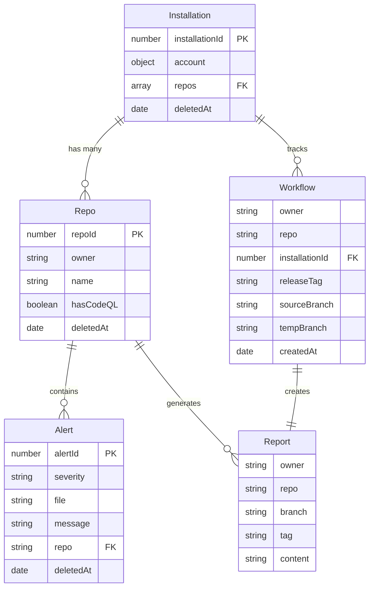
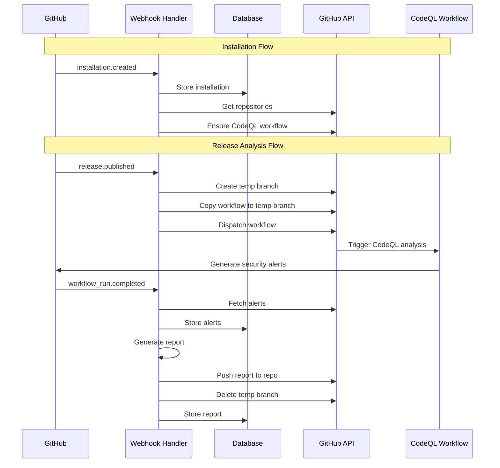

# GitHub CodeQL App - Flow Diagrams

This document contains visual flow diagrams for the GitHub CodeQL App. These diagrams can be viewed in any Markdown viewer that supports Mermaid diagrams (GitHub, GitLab, VS Code with Mermaid extension, etc.).

## Main Application Flow



## Component Interaction Diagram



## Database Entity Relationship Diagram



## Webhook Event Flow



## How to View These Diagrams

### Option 1: GitHub/GitLab
- These diagrams will render automatically when viewing this file on GitHub or GitLab

### Option 2: VS Code
- Install the "Mermaid Preview" extension
- Open this file and use the preview pane

### Option 3: Online Mermaid Editor
- Copy the diagram code to [mermaid.live](https://mermaid.live)
- View and export as PNG/SVG

### Option 4: Command Line
```bash
# Install mermaid-cli
npm install -g @mermaid-js/mermaid-cli

# Generate PNG from diagram
mmdc -i FLOW_DIAGRAMS.md -o diagrams.png
```

### Option 5: Browser Extension
- Install "Mermaid Diagrams" browser extension
- View diagrams directly in your browser
